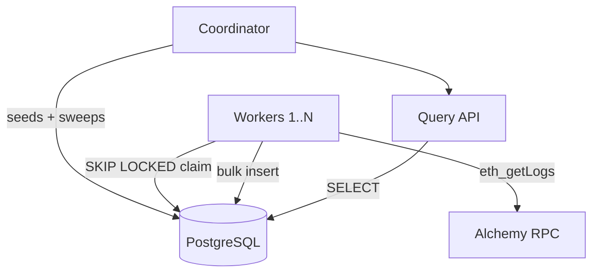

# EVM Event Indexer

A horizontally scalable system that indexes all EVM event logs from Ethereum mainnet over a configurable historical block range, stores them in PostgreSQL, and exposes them through a query API. Written in Go.

**What it does:**
- Fetches raw event logs via Alchemy's `eth_getLogs` across a historical block range
- Distributes ingestion work across N concurrent workers with no overlaps, gaps, or duplicate writes
- Persists all logs to PostgreSQL, indexed for efficient read queries
- Serves a query API filterable by **contract address**, **event signature** (`topic0`), and **block range**

## Architecture



The system runs as two process roles in separate containers, scaled with `docker compose --scale`:

**Coordinator** (1 instance) — divides the block range into fixed-size chunks, seeds them into the `chunks` table, runs the sweep goroutine for crash recovery, and serves the query API. Polls the DB for completion and prints a final summary when all chunks reach a terminal state.

**Workers** (N instances) — each independently claims a chunk with `SELECT FOR UPDATE SKIP LOCKED`. No two workers ever process the same chunk. Each worker calls Alchemy's `eth_getLogs` for its block range, bulk-inserts the results, and marks the chunk `done` in a single atomic transaction. If Alchemy returns a "response too large" error, the worker splits the chunk into two half-range sub-chunks and re-queues them — this is required for correctness in high-density block ranges.

**Sweep** — runs on a ticker inside the coordinator. Re-queues `in_progress` chunks whose `claimed_at` has expired (worker crashed or stalled). Chunks that exhaust `MAX_ATTEMPTS` are marked `failed`.

**Coordination model:** All coordination state lives in PostgreSQL. `SKIP LOCKED` ensures workers never queue behind each other — each worker skips rows already locked by a peer and immediately moves to the next available chunk. Adding workers never causes conflicts; throughput scales until the RPC rate limit is reached.

**Idempotency:** Two layers prevent duplicate writes:
1. Chunk claiming is atomic — only one worker ever processes a given chunk at a time
2. Log inserts use `ON CONFLICT (tx_hash, log_index) DO NOTHING` — the bulk insert and chunk status update are committed in a single transaction, so partial writes cannot occur; the conflict guard exists as a safety net against any edge case that could produce duplicate log entries

Together these guarantee **exactly-once storage**: the atomic transaction ensures a chunk is either fully committed or fully rolled back, and the unique constraint on `(tx_hash, log_index)` is a belt-and-suspenders guard against any duplicate log entries.

## Data Model

### `chunks` table — coordination queue

```sql
CREATE TABLE chunks (
    id            SERIAL PRIMARY KEY,
    from_block    INTEGER      NOT NULL,
    to_block      INTEGER      NOT NULL,
    status        TEXT         NOT NULL DEFAULT 'pending',
    worker_id     INTEGER,
    attempts      INTEGER      NOT NULL DEFAULT 0,
    claimed_at    TIMESTAMPTZ,
    completed_at  TIMESTAMPTZ,
    CONSTRAINT chunks_range_unique UNIQUE (from_block, to_block)
);
```

Chunk status lifecycle: `pending → in_progress → done` (or `→ failed` after exhausting attempts). The `UNIQUE(from_block, to_block)` constraint makes chunk seeding idempotent via `INSERT ... ON CONFLICT DO NOTHING`.

### `logs` table — event data

```sql
CREATE TABLE logs (
    id            BIGSERIAL    PRIMARY KEY,
    block_number  INTEGER      NOT NULL,
    block_hash    TEXT         NOT NULL,
    tx_hash       TEXT         NOT NULL,
    log_index     INTEGER      NOT NULL,
    address       TEXT         NOT NULL,  -- stored lowercase
    topic0        TEXT,
    topic1        TEXT,
    topic2        TEXT,
    topic3        TEXT,
    data          TEXT         NOT NULL,
    CONSTRAINT logs_unique UNIQUE (tx_hash, log_index)
);
```

### Indexes

Three indexes cover all meaningful filter combinations with no full table scans:

```sql
-- Covers: address, address+topic0, address+topic0+block_range
CREATE INDEX logs_addr_topic0_block_idx ON logs (address, topic0, block_number);

-- Covers: topic0, topic0+block_range
CREATE INDEX logs_topic0_block_idx ON logs (topic0, block_number);

-- Covers: block_range only
CREATE INDEX logs_block_number_idx ON logs (block_number);
```

All 7 filter combinations are index-covered. Write cost is 3 index updates + 1 unique check per inserted row.

**PostgreSQL** It handles both coordination (work queue via `SKIP LOCKED`) and storage in a single system, eliminating operational overhead. MVCC means concurrent reads from the query API never block ingestion writes.

## Running with Docker

### Prerequisites
- Docker
- An Alchemy API key (or any Ethereum JSON-RPC endpoint)

### Setup

```bash
cp .env.example .env
# Edit .env — set RPC_URL to your Alchemy endpoint
```

### Start (1 worker by default)

```bash
make docker-up
```

### Scale to N workers

```bash
make scale N=4
# or: docker compose up --build --scale worker=4
```

### Fresh run with N workers (truncates existing data and re-indexes)

```bash
make fresh-start N=4
# or: FRESH_START=true docker compose up --build --scale worker=4
```

### Stop

```bash
make docker-down
```

### Running locally (without Docker)

```bash
cp .env.example .env  # set DATABASE_URL and RPC_URL

# Terminal 1 — coordinator (runs migrations, seeds chunks, serves API)
MODE=coordinator go run ./cmd/indexer

# Terminal 2+ — one or more workers
MODE=worker go run ./cmd/indexer
```

## Configuration

All configuration is via environment variables (`.env` is loaded automatically). `docker-compose.yml` sets `MODE` per service — it does not need to be in `.env`.

| Variable | Default | Description |
|---|---|---|
| `RPC_URL` | required | Alchemy (or any JSON-RPC) endpoint |
| `DATABASE_URL` | required | Postgres connection string |
| `BLOCK_FROM` | required | Start block (inclusive) |
| `BLOCK_TO` | required | End block (inclusive) |
| `MODE` | `coordinator` | Process role: `coordinator` or `worker` |
| `CHUNK_SIZE` | `10` | Blocks per chunk |
| `MAX_ATTEMPTS` | `3` | Max retries before a chunk is marked failed |
| `SWEEP_INTERVAL_MS` | `30000` | Sweep frequency (ms) |
| `WORKER_INTERVAL_MS` | `10` | Worker idle sleep (ms); `0` = max throughput |
| `CLAIM_TIMEOUT_MS` | `120000` | Chunk claim timeout before sweep reclaims (ms) |
| `FRESH_START` | `true` | Truncate and re-index on startup (coordinator only) |
| `API_PORT` | `3000` | HTTP API port (coordinator only) |
| `DB_POOL_SIZE` | `20` | pgxpool max connections |

## API

The API is served by the coordinator at `http://localhost:3000`. It remains available after indexing completes.

### `GET /logs`

Query indexed event logs with optional filters.

| Parameter | Description |
|---|---|
| `address` | Contract address (case-insensitive) |
| `topic0` | Event signature hash |
| `from_block` | Start of block range (inclusive) |
| `to_block` | End of block range (inclusive) |
| `limit` | Page size (default `100`, max `1000`) |
| `offset` | Pagination offset (default `0`) |

**All logs (first page):**
```bash
curl "http://localhost:3000/logs"
```

**Filter by: Address + event + block range:**
```bash
curl "http://localhost:3000/logs?address=0xa0b86991c6218b36c1d19d4a2e9eb0ce3606eb48&topic0=0xddf252ad1be2c89b69c2b068fc378daa952ba7f163c4a11628f55a4df523b3ef&from_block=19000000&to_block=19001000"
```

**Paginate:**
```bash
curl "http://localhost:3000/logs?limit=50&offset=100"
```

**Response:**
```json
{
  "count": 47,
  "offset": 0,
  "limit": 100,
  "logs": [
    {
      "blockNumber": 19000000,
      "blockHash": "0x...",
      "txHash": "0x...",
      "logIndex": 3,
      "address": "0xa0b86991c6218b36c1d19d4a2e9eb0ce3606eb48",
      "topic0": "0xddf252ad...",
      "topic1": "0x...",
      "topic2": "0x...",
      "topic3": null,
      "data": "0x..."
    }
  ]
}
```

### `GET /health`

Returns indexing progress. `workers.active` reflects the current `in_progress` chunk count — a proxy for how many workers are actively processing.

```bash
curl "http://localhost:3000/health"
```

```json
{
  "status": "ok",
  "workers": {
    "active": 3
  },
  "chunks": {
    "total": 50,
    "done": 31,
    "in_progress": 3,
    "pending": 14,
    "failed": 2,
    "estimated_completion_pct": 62.0
  }
}
```

## Performance

Performance measurement is done one 5k blocks with 1,2 and 4 workers in parallel.

**Indexing 5k blocks was nearly 3x faster with 4 workers compared to the single worker.**

Config for performance testing:
- CHUNK_SIZE=10
- BLOCK_FROM=19000000
- BLOCK_TO=19005000
- WORKER_INTERVAL_MS=10

#### Indexing logs with 1 worker
`make fresh-start N=1`

```
════════════════════════════════════════════
  EVM Indexer — Run Complete
  Block range:    19000000 – 19005000
  Total chunks:   501
  Done:           501
  Failed:         0
  Total logs:     1323301
  Total blocks:   5001
  Total time:      130.0s
  Avg rate:       38.5 blocks/s | 10179 logs/s
════════════════════════════════════════════
```

#### Indexing logs with 2 workers
`make fresh-start N=2`

```
════════════════════════════════════════════
  EVM Indexer — Run Complete
  Block range:    19000000 – 19005000
  Total chunks:   501
  Done:           501
  Failed:         0
  Total logs:     1323301
  Total blocks:   5001
  Total time:      70.0s
  Avg rate:       71.4 blocks/s | 18902 logs/s
════════════════════════════════════════════
```


#### Indexing logs with 4 workers
`make fresh-start N=4`

Rate limits were constantly being hit under Alchemy's free tier plan.
Different configuration options were fine-tuned for best performance.
The following config gave best performance, but it was still slower
than indexing with 2 workers.

Additional config in .env file:
```
SWEEP_INTERVAL_MS=10000    # sweep runs every 10s
CLAIM_TIMEOUT_MS=15000     # chunk re-queued after 15s if still in_progress
MAX_ATTEMPTS=3             # 3 claims before marked failed
WORKER_INTERVAL_MS=250     # 250ms between two consecutive iterations on worker
```

```
════════════════════════════════════════════
  EVM Indexer — Run Complete
  Block range:    19000000 – 19005000
  Total chunks:   501
  Done:           501
  Failed:         0
  Total logs:     1323301
  Total blocks:   5001
  Total time:      80.0s
  Avg rate:       62.5 blocks/s | 16540 logs/s
════════════════════════════════════════════

```

When upgrading to pay-as-you go Alchemy plan, rate limits weren't hit and indexing
performance was considerably better (under the same config as benchmarking with 1 and 2 workers):
```
════════════════════════════════════════════
  EVM Indexer — Run Complete
  Block range:    19000000 – 19005000
  Total chunks:   501
  Done:           501
  Failed:         0
  Total logs:     1323301
  Total blocks:   5001
  Total time:      45.0s
  Avg rate:       111.1 blocks/s | 29405 logs/s
════════════════════════════════════════════
```

## Production Considerations

### Observability & Alerting

The current system emits structured text log lines per chunk and sweep cycle. For production:

- **Metrics:** Expose a Prometheus `/metrics` endpoint with gauges for `chunks_pending`, `chunks_done`, `chunks_failed`, `workers_active`, and a histogram for per-chunk processing latency and RPC call duration.
- **Dashboards:** Grafana dashboard tracking ingestion rate over time, worker utilization, RPC error/retry rate, and DB connection pool saturation.
- **Alerting:** Alert on sustained chunk failure rate above a threshold, `in_progress` count stalling without progress (sweep not recovering), or all workers going idle with pending chunks remaining. Structured JSON logs (Go's `log/slog`) shipped to a log aggregator (Datadog, Loki) enable log-based alerting as a complement.

### Real-Time Indexing & Reorg Handling

Currently historical backfill only. For live indexing:

- Add a **head-follower worker** that polls `eth_blockNumber` or subscribes to `eth_subscribe newHeads` (WebSocket) and enqueues new blocks as they arrive.
- Track `block_hash` per ingested chunk. On a reorg, new canonical blocks arrive at the same height with a different hash — detect this, delete orphaned logs by `block_hash`, and re-ingest the replacement block. Mainnet reorg depth is typically 1–2 blocks; handling up to 64 is considered safe.
- The chunk-based coordination model extends naturally: new head blocks become pending chunks picked up by the same worker pool.

### Multi-Chain Support

- Add a `chain_id` column to both `chunks` and `logs` tables.
- Extend indexes to include `chain_id` as the leading column: `(chain_id, address, topic0, block_number)`. This ensures chain-scoped queries use an index seek and never scan rows from other chains.
- For operational isolation, **separate schemas or databases per chain** are preferable — avoids cross-chain write contention, allows independent partitioning strategies, and simplifies access control and retention policies.
- The coordinator and workers are stateless beyond configuration; pointing them at a different `RPC_URL` and `chain_id` is sufficient to add a new chain.

### Coordination Alternatives

The current approach uses PostgreSQL `SKIP LOCKED` as a work queue — correct, low-latency, and zero additional infrastructure. Alternatives at scale:

- **Redis Streams / RPOPLPUSH:** Sub-millisecond claim latency, purpose-built for queue semantics. Adds a new dependency but is worth considering if the DB becomes a bottleneck at thousands of concurrent workers.
- **AWS SQS / RabbitMQ:** Native visibility timeouts handle the sweep/recovery pattern. Good fit if the queue needs to be consumed by heterogeneous consumers or across regions.
- For this workload, PostgreSQL remains the correct choice: the claim cycle is fast (microseconds), queue depth is modest, and a single system for coordination and storage reduces operational surface.

### Auto-Scaling

- **Kubernetes + KEDA:** Expose `chunks_pending` as a custom Prometheus metric and configure KEDA to scale the worker `Deployment` up when the queue is deep and scale to zero when empty. The coordinator remains a single replica.
- **AWS ECS Auto Scaling:** Same pattern using Application Auto Scaling with a custom CloudWatch metric derived from the `/health` endpoint's `pending` chunk count.
- The coordination model supports this natively — workers are stateless and can be added or removed at any point without any reconfiguration.

### Storage Scaling

Ethereum mainnet averages ~300 logs/block. The 5k-block demo range produced 1.3M rows; a full mainnet archive would exceed 2 billion rows.

- **Partition by block range:** Use `PARTITION BY RANGE (block_number)` with epoch-aligned boundaries. Queries scoped to a block range scan only the relevant partition.
- **Index bloat during backfill:** Bulk inserts cause index bloat; periodic `REINDEX CONCURRENTLY` or switching to `BRIN` indexes for the `block_number` column on cold archive partitions reduces storage footprint significantly.
- **Multi-chain isolation:** Separate tables or schemas per chain avoid cross-chain hot spots on shared indexes.

### RPC Provider & Self-Hosted Node

- **Provider diversity:** Maintain connections to multiple providers (Alchemy, Infura, QuickNode) behind a circuit breaker. Route requests round-robin; automatically fail over on 429 or timeout. This eliminates the rate limit ceiling that constrained 4-worker throughput in the demo.
- **Self-hosted archive node:** This eliminates rate limits entirely, reduces latencies, and removes dependency on third-party uptime. There are significant hardware requirements to take into account especially for having multi chain nodes and infrastructure to maintain. 

### Query API Scaling

The current API is a single HTTP handler backed by the shared connection pool. For production:

- **Read replicas:** Route all `GET /logs` queries to a PostgreSQL read replica. Ingestion workers write only to the primary; the query path never contends with bulk inserts.
- **Redis caching:** Cache responses for hot filter combinations (e.g. top token Transfer events by address) with a short TTL. Cache invalidation is simple — the dataset only grows, so entries remain valid until evicted or TTL expires.
- **Load balancing & horizontal API scaling:** Multiple stateless API instances behind an ALB or nginx. Each instance uses its own read-replica connection pool.
- **Rate limiting & authentication:** API key auth with per-key rate limiting to prevent abuse and enable usage accounting.
- **Webhooks / event subscriptions:** Allow clients to register filters (address + topic0) and receive POST callbacks as matching logs are indexed — removes the need for polling and enables real-time downstream pipelines.
